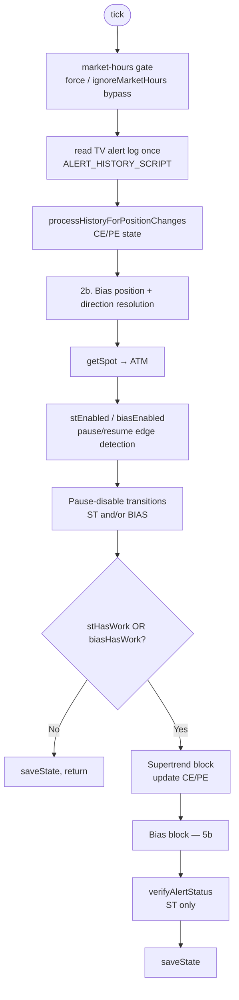
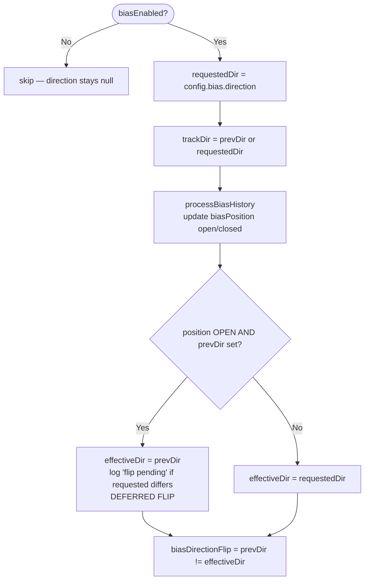
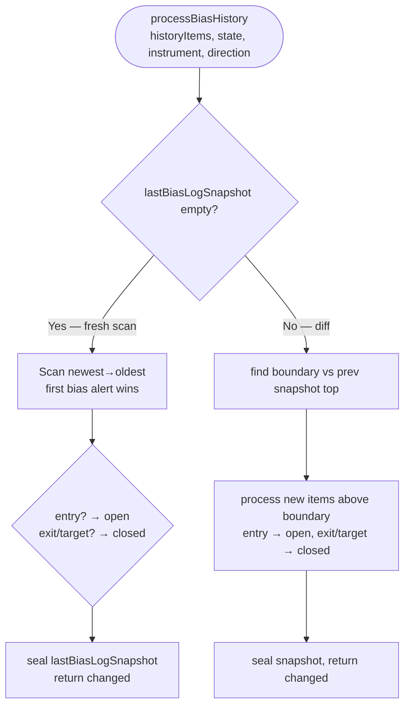
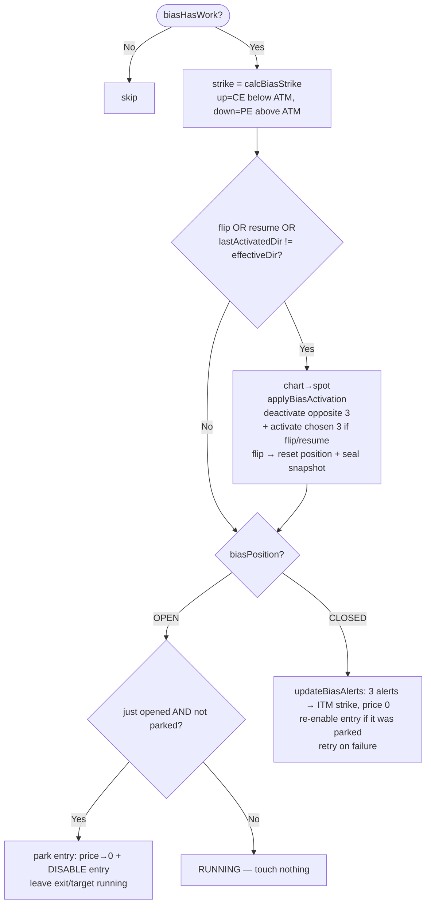
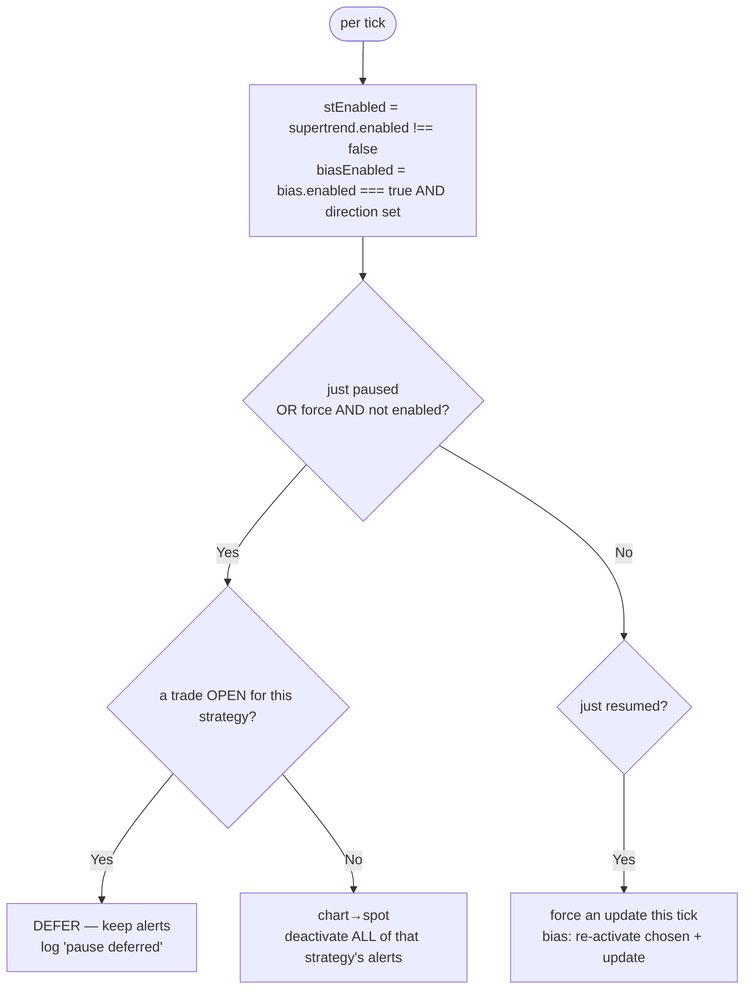
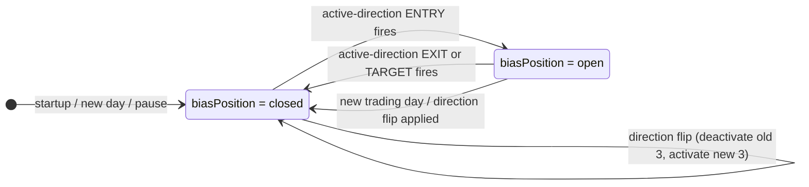

# Bias Monitor — Complete Flow Reference

Manual-direction strategy **merged into** `monitors/monitor.js`. It is **not** a separate
process — its block runs inside the same 60s tick as the supertrend block, on the same
TradingView tab / Alerts panel, so the two strategies never collide.

- **Direction is manual** (UI toggle / `bias.direction`), not pattern-detected.
- Keeps the chosen direction's **3 alerts** (entry / exit / target) on the current ITM
  option strike via `alert_update` (symbol **+ price 0**). **up → CE** (strike below ATM),
  **down → PE** (strike above ATM).
- The opposite direction's 3 alerts are **deactivated**. Only one direction is ever active.
- **Run/Pause** per strategy; bias is **paused by default and reset to paused on every
  start/restart** (manual trading — resume explicitly each session).

---

## 1. Where the bias block sits in the tick

---

## 2. Bias position + direction resolution (step 2b)

`biasJustOpened` / `biasJustClosed` are computed from the position change this tick.

---

## 3. processBiasHistory (open/closed for the active direction)

Single position (only the active direction can fire — the opposite is deactivated).
A trade is **OPEN** on entry, **CLOSED** on exit **OR** target.

---

## 4. Bias alert update decision (step 5b)

**Key rule:** a running trade's exit/target are never touched; only the entry is parked
(price 0 + disabled) when it fires, and re-enabled when the trade closes.

---

## 5. Pause / Resume

- Config changes apply **immediately** — the monitor watches `config/monitor-config.json`
  and runs a force tick on change (no 60s wait).
- The UI also **blocks** pausing while a trade is open (toggle disabled).

---

## 6. Position + direction state transitions

---

## 7. Use cases

### Run / Pause

| Scenario                              | Behaviour                                                                     |
| ------------------------------------- | ----------------------------------------------------------------------------- |
| Monitor starts (bias default)         | Bias **reset to paused**; on the first force tick all 6 bias alerts disabled  |
| Resume bias (no open trade)           | Re-activate chosen 3 + update (symbol→ITM strike, price 0); opposite disabled |
| Pause bias (no open trade)            | All 6 bias alerts deactivated; block stops managing                           |
| Pause requested while a trade is OPEN | **Blocked** (UI) / **deferred** (monitor) until the trade closes              |
| Toggle in UI                          | Applies within ~1s (config-file watch runs a force tick)                      |

### Direction / flip

| Scenario                        | Behaviour                                                        |
| ------------------------------- | ---------------------------------------------------------------- |
| Flip direction, no open trade   | Deactivate old 3, activate + update new 3 (price 0)              |
| Flip direction while trade OPEN | **Deferred** — applied automatically once the position closes    |
| First reconcile (startup)       | Deactivate the opposite direction; chosen assumed already active |

### Alert update / trade

| Scenario                     | Behaviour                                                      |
| ---------------------------- | -------------------------------------------------------------- |
| ATM shifts, no open trade    | Chosen 3 updated to new strike (shares ST 60s cooldown)        |
| Entry fires (trade opens)    | Entry **parked**: price 0 + disabled; exit/target left running |
| Trade running (steady)       | Alerts untouched                                               |
| Exit or target fires (close) | Re-enable entry; sync 3 alerts to current strike               |
| Update fails                 | `retryNextTick.bias = true` — retries next tick                |

---

## 8. Strike routing

| Direction | Option | Strike formula          |
| --------- | ------ | ----------------------- |
| up        | CE     | ATM − (itmDepth × step) |
| down      | PE     | ATM + (itmDepth × step) |

Instrument / day / ITM-depth routing is shared with supertrend (see `supertrend-monitor.md`).

---

## 9. Alert names (must already exist in TradingView)

| Instrument | Direction | Entry              | Exit              | Target              |
| ---------- | --------- | ------------------ | ----------------- | ------------------- |
| NIFTY      | up (CE)   | `0NiftyBiasEntry`  | `0NiftyBiasExit`  | `0NiftyBiasTarget`  |
| NIFTY      | down (PE) | `zNiftyBiasEntry`  | `zNiftyBiasExit`  | `zNiftyBiasTarget`  |
| SENSEX     | up (CE)   | `0SensexBiasEntry` | `0SensexBiasExit` | `0SensexBiasTarget` |
| SENSEX     | down (PE) | `zSensexBiasEntry` | `zSensexBiasExit` | `zSensexBiasTarget` |

`0` prefix sorts up-alerts to the top of the Alerts panel; `z` sorts down-alerts to the bottom.

---

## 10. EOD report

`scripts/generate-bias-report.js` — parses **entry → exit/target** pairs from the alert log,
maps up→CE / down→PE, fetches each option's 1m prices from TradingView, and writes
`logs/bias/1min/daily-trades-YYYY-MM-DD.json` in the same schema as the supertrend
report. View at `/bias-reports` (the 1-min reports UI pointed at bias data); the Trade
Reports dashboard (`/supertrend-reports`) lists it as a third strategy card. `exitType`
records whether the trade closed on `exit` (SL/signal) or `target`.

---

## 11. State fields (in `config/position.json` → `bias` section)

| Field          | Meaning                                             |
| -------------- | --------------------------------------------------- |
| `enabled`      | last-seen run/pause flag (edge detection)           |
| `position`     | active-direction trade state (open/closed)          |
| `direction`    | direction being operated on (up/down)               |
| `lastStrike`   | strike the 3 bias alerts were last set to           |
| `activatedDir` | direction whose alerts are currently activated      |
| `entryParked`  | entry was price→0'd + disabled during an open trade |

(The bias log diff-baseline is in-memory only — not persisted.)
