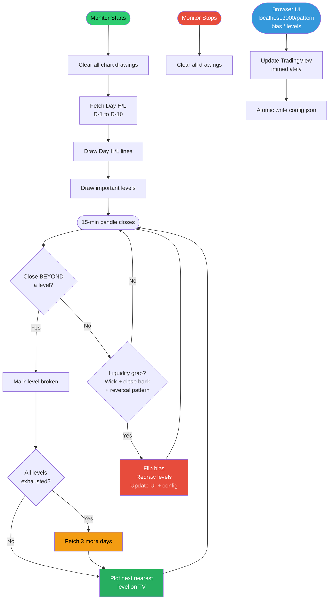

# Pattern Monitor — Design Document

## Strategy Overview
- Everything runs on **15-min candles**
- User sets **bias** (up/down) based on their own 15-min price action analysis
- **Day H/L levels** (auto-fetched) + **Important levels** (user-configured) decide trend continue or flip

---

## Config (2 fields only)
```json
{
  "bias": "up",
  "importantLevels": [24450, 24380]
}
```
- No `active`
- No zone
- No candleTimeframe (always 15-min)
- No target / sl / optionsMode / symbol

---

## Level Logic (Reversal vs Continuation)

### At a key level (day H/L or important level):
| 15-min candle behaviour | Decision |
|---|---|
| Close **beyond** the level | Level broken → mark as broken → watch next level → bias continues |
| Wick into level + close **back** + reversal pattern | Level respected → flip bias → update UI + config |

### Reversal patterns at level:
- **bias=up** at resistance → Shooting Star or Doji + close below level → flip to down
- **bias=down** at support → Hammer or Doji + close above level → flip to up

---

## Day H/L Cache — Dynamic
- Start: fetch last **10 completed days** (D-1 to D-10)
- Refresh: once per day
- **brokenHighs / brokenLows**: levels where 15-min candle closed beyond → permanently excluded
- **Auto-expand**: when all unbroken levels in bias direction are exhausted → fetch **3 more days** (D-11 to D-13), repeat as needed
- Draw on chart: only **nearest resistance** (bias=up) + **nearest support** (bias=down) at any time

---

## Monitor Load / Stop Behaviour
| Event | Day H/L lines | Important level lines |
|---|---|---|
| Monitor starts | Always draw | Always draw |
| Monitor stops / exit | Clear all | Clear all |

---

## Two UIs — Roles

| UI | Purpose | User does here |
|---|---|---|
| **Browser UI** `localhost:3000/pattern` | Configuration & control | Set bias, add/remove important levels, view current state |
| **TradingView** | Display only | See drawn levels, colored candles (Pine Script) — no configuration |

User **never** configures in TradingView. User **never** edits config file manually.

---

## Browser UI → Server → TradingView Flow

```
User changes bias in Browser UI
  → POST /api/pm/bias  { bias: "down" }
  → Server: redraw levels on TradingView chart immediately
  → Server: atomic write to config.json
```

All changes flow: **Browser UI → Server → TradingView + config.json**

### Atomic config write (no corruption):
```js
fs.writeFileSync(CONFIG_FILE + '.tmp', JSON.stringify(cfg, null, 2));
fs.renameSync(CONFIG_FILE + '.tmp', CONFIG_FILE);
```

---

## Section 1 — Setup on Load
- Clear all chart drawings
- Fetch day H/L (D-1 to D-10)
- Draw day H/L lines
- Draw important levels
- User controls everything from UI

---

## Section 2 — 15-min Candle Logic

> Runs every 15-min candle close. No flags checked — always active.

### Rule 1 — Level Broken (trend continues)
- Price **crosses and closes beyond** a day H/L level
- Mark level broken → plot next nearest level on TradingView chart
- If all levels exhausted → fetch 3 more days → plot next nearest level
- **No UI or config update needed** — chart only

### Rule 2 — Liquidity Grab (flip bias)
- Price wicks into a level + **closes back** + reversal pattern
- Flip bias → redraw levels for new bias direction
- **Update UI + config** (bias changed)

### What gets updated on each event:
| Event | TradingView chart | Config | Browser UI |
|---|---|---|---|
| Level broken | Remove old line, draw next level | No change | No change |
| All levels exhausted | Fetch more days, draw next level | No change | No change |
| Liquidity grab | Redraw levels for new bias | Flip bias | Update bias display |

> ⚠️ Pattern detection for trade alerts — **TBD (not yet discussed)**

---

## Pine Script Visual Indicator
- File: `scripts/pine/pattern-candles.pine`
- Loaded manually once in TradingView — colors pattern candles
- Runs independently from the monitor

| Pattern | Color |
|---|---|
| Hammer | Lime |
| Bullish Engulfing | Blue |
| Doji | Yellow |
| Shooting Star | Red |

---

## Flow Diagram



---

## Progress Tracker

### Done ✅
- [x] Rewrote pattern-monitor.js from scratch (v2, ~300 lines)
- [x] Removed all old complexity (zone break, liquidity grab, options mode, trade state, drag sync, trail SL)
- [x] Cleaned up 23 unnecessary files from project
- [x] Pine Script candle coloring indicator (`scripts/pine/pattern-candles.pine`)
- [x] Loaded Pine Script in TradingView

### In Progress 🔄
- [ ] Switch pattern monitor to 15-min only
- [ ] Remove `active` and `zone` from config — only `bias` + `importantLevels`
- [ ] Add dynamic day H/L cache (D-10, auto-expand by 3)
- [ ] Draw day H/L + important levels on load (always)
- [ ] Level break logic (close beyond = broken → next level)
- [ ] Liquidity grab logic (wick + close back + pattern → flip bias)

### Not Started ❌
- [ ] Browser UI page `localhost:3000/pattern` (bias toggle, add/remove important levels, current state)
- [ ] Server API endpoints (`POST /api/pm/bias`, `POST /api/pm/levels`)
- [ ] Immediate TV update on UI action
- [ ] Atomic config write
- [ ] Auto-expand day cache when all levels exhausted

### TBD — Not Yet Discussed 🔲
- [ ] Pattern detection for trade alerts — what triggers, what alerts to update
