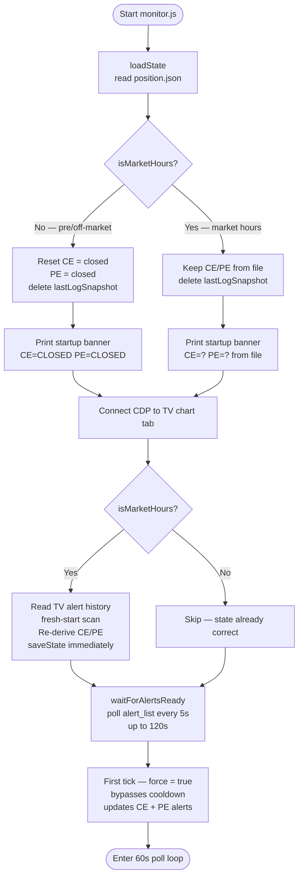
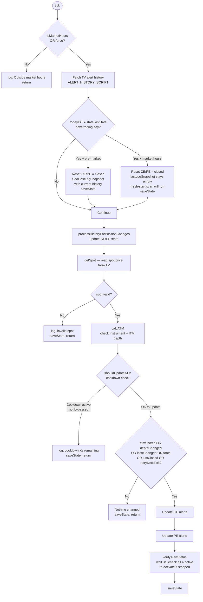
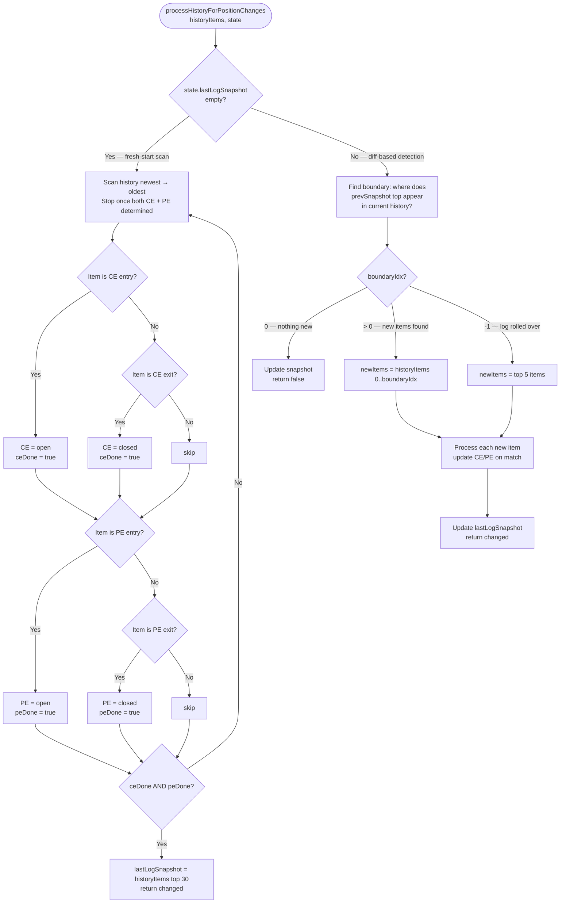
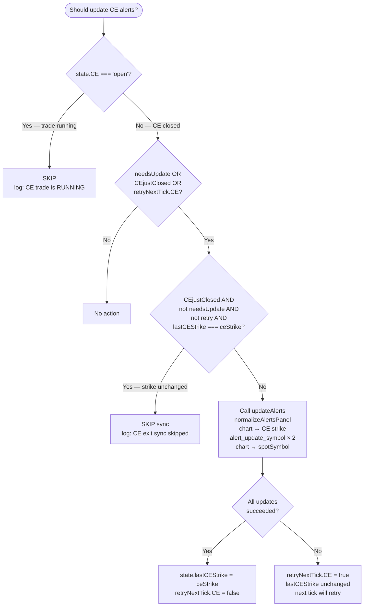
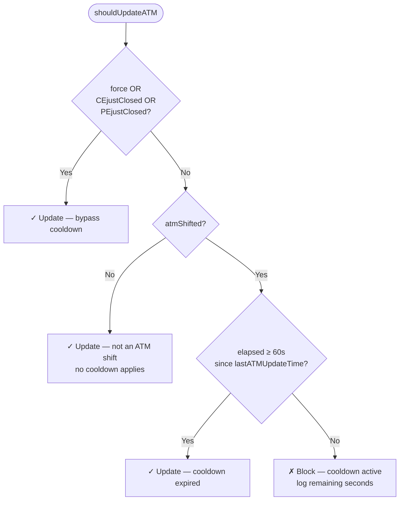
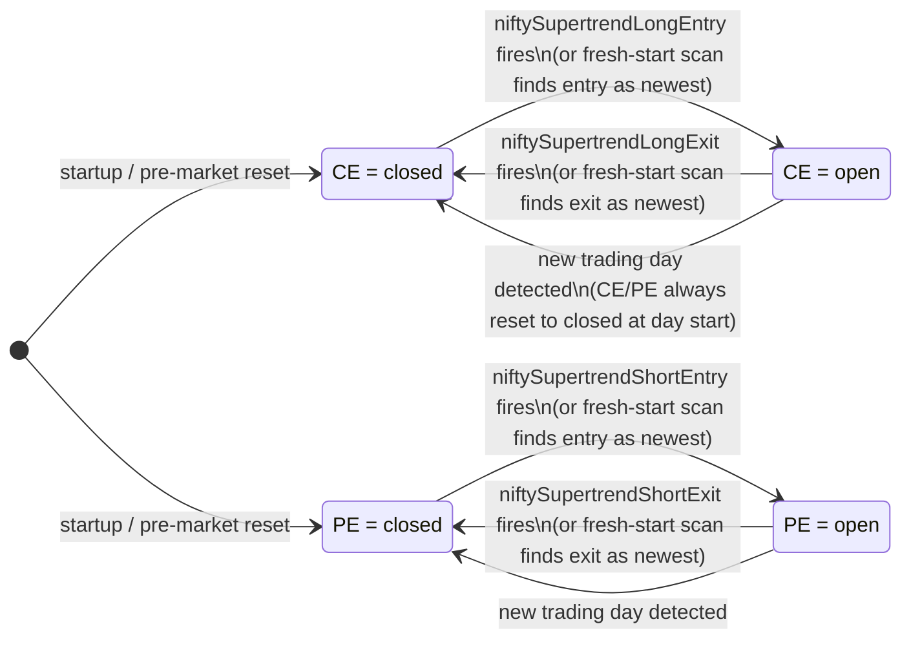

# Supertrend Monitor — Complete Flow Reference

`monitors/monitor.js` — polls every 60 seconds during market hours (09:10–15:30 IST, Mon–Fri).

---

## 1. Startup Flow

---

## 2. Per-Tick Flow

---

## 3. processHistoryForPositionChanges

Called every tick at step 2. Behaviour depends on whether `lastLogSnapshot` is populated.

---

## 4. Alert Update Decision — per side

Same logic applies to both CE and PE (substitute CE↔PE).

---

## 5. ATM Cooldown Logic

---

## 6. Position State Transitions

---

## 7. All Use Cases

### Startup use cases

| Scenario                               | What happens                                                                                                                           |
| -------------------------------------- | -------------------------------------------------------------------------------------------------------------------------------------- |
| Start before 09:10 (pre-market)        | CE/PE reset to closed in `loadState()`. Snapshot sealed on first tick so yesterday's history is never replayed.                        |
| Start after 15:30 (post-market)        | Same as pre-market — CE/PE reset to closed.                                                                                            |
| Start during market hours, same day    | CE/PE loaded from file. Immediately after CDP connects, TV alert history is read and CE/PE is re-derived and saved to `position.json`. |
| Start during market hours, new day     | CE/PE loaded from file, then reset to closed in first tick (new-day detection). Fresh-start scan re-derives any already-open trades.   |
| Continuous running, midnight crossover | First pre-market tick detects `lastDate ≠ today`, resets CE/PE=closed, seals snapshot.                                                 |

### Alert update use cases

| Scenario                             | CE alerts                                           | PE alerts                       |
| ------------------------------------ | --------------------------------------------------- | ------------------------------- |
| ATM shifts, no trade running         | Updated immediately (first shift)                   | Updated immediately             |
| ATM shifts again within 60s          | Blocked by cooldown                                 | Blocked by cooldown             |
| ATM shifts, CE trade running         | Skipped — trade running                             | Updated                         |
| ATM shifts, PE trade running         | Updated                                             | Skipped — trade running         |
| CE trade exits                       | Force-sync CE to current strike (cooldown bypassed) | Continues normally              |
| PE trade exits                       | Continues normally                                  | Force-sync PE to current strike |
| CE exit sync, strike unchanged       | Skipped — already on correct strike                 | —                               |
| Alert update fails (panel not ready) | `retryNextTick.CE = true` — retries every 60s       | Same                            |
| `force = true` (startup first tick)  | Always updates, bypasses cooldown                   | Always updates                  |
| Instrument changes day-to-day        | Both sides updated                                  | Both sides updated              |
| ITM depth changes (config edit)      | Both sides updated                                  | Both sides updated              |

### Position state use cases

| Scenario                                                 | Behaviour                                                                           |
| -------------------------------------------------------- | ----------------------------------------------------------------------------------- |
| PE exit fired while monitor was down                     | Market-hours restart reads history → finds exit → PE=closed saved immediately       |
| PE entry fired while monitor was down                    | Market-hours restart reads history → finds entry → PE=open preserved                |
| Both CE and PE trades running                            | Fresh-start scan finds both entries → CE=open, PE=open. Both alert updates skipped. |
| History log rolled over (> 30 items since last snapshot) | Diff detects no boundary → processes top 5 items as fallback                        |
| TradingView restarted, history empty                     | `historyItems.length === 0` → loaded state kept as-is                               |

### Alert panel use cases

| Scenario                                       | Behaviour                                                           |
| ---------------------------------------------- | ------------------------------------------------------------------- |
| Alerts panel on Log tab after history read     | `normalizeAlertsPanel` always clicks Alerts tab before every update |
| Alerts panel closed                            | `normalizeAlertsPanel` opens it, clicks Alerts tab                  |
| Alert not found on first attempt               | `retryNextTick = true` → retry on next 60s tick                     |
| Alert stopped/inactive after update            | `verifyAlertStatus` re-activates it (3s after update)               |
| All 4 alerts not found in `waitForAlertsReady` | Polls every 5s up to 120s — TV may still be syncing from cloud      |

---

## 8. Key Constants

| Constant                     | Value      | Purpose                                       |
| ---------------------------- | ---------- | --------------------------------------------- |
| `POLL_MS`                    | 60 000 ms  | Tick interval                                 |
| `ATM_COOLDOWN_MS`            | 60 000 ms  | Min gap between ATM-shift updates             |
| `MARKET_OPEN_MIN`            | 09:10 IST  | Start of market hours                         |
| `MARKET_CLOSE_MIN`           | 15:30 IST  | End of market hours                           |
| `waitForAlertsReady` timeout | 120 000 ms | Max wait for alerts panel on startup          |
| Chart settle wait            | 3 000 ms   | After chart symbol switch before alert update |
| Between alert dialogs        | 1 500 ms   | After each `alert_update_symbol` call         |

---

## 9. Instrument Routing

| Day       | Instrument | Strike step | ITM depth | Expiry   |
| --------- | ---------- | ----------- | --------- | -------- |
| Monday    | NIFTY      | 50          | ITM-2     | Tuesday  |
| Tuesday   | NIFTY      | 50          | ITM-2     | Tuesday  |
| Wednesday | SENSEX     | 100         | ITM-2     | Thursday |
| Thursday  | SENSEX     | 100         | ITM-2     | Thursday |
| Friday    | NIFTY      | 50          | ITM-1     | Tuesday  |

Strike formula: CE = ATM − (itmDepth × step), PE = ATM + (itmDepth × step).
Expiry shifts back if the expiry day is a holiday (checked against `config/holidays.json`).
